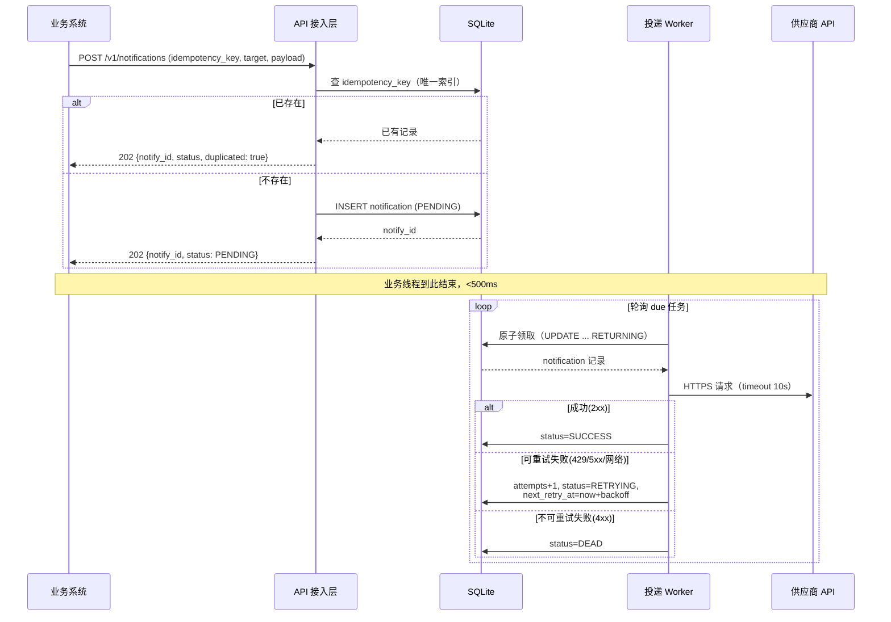

# 技术设计文档：NotifyHub v1.0

> 版本：v1.0 ｜ 上游：`docs/prd.md` ｜ 下游：`docs/test-cases.md`

## 1. 总体架构

```
┌────────────┐   POST /v1/notifications   ┌──────────────────────────────────────┐
│  业务系统   │ ─────────────────────────▶ │            NotifyHub (单进程)         │
└────────────┘ ◀───────────────────────── │                                      │
                                           │  ┌──────────────┐   ┌────────────┐  │
                              202 Accepted │  │ API 接入层    │──▶│ 任务存储    │  │
                              + notify_id  │  │ (Hono/Express)│   │ (SQLite)   │  │
                                           │  └──────────────┘   └─────┬──────┘  │
                                           │        ▲ query             │ poll/   │
                                           │  ┌─────┴──────┐            ▼ claim   │
                                           │  │ 状态查询    │   ┌────────────┐     │
                              GET /v1/...  │  │  (同端口)   │   │ 投递 Worker │     │
                                           │  └────────────┘   └─────┬──────┘     │
                                           └─────────────────────────┼────────────┘
                                                                     ▼ HTTPS
                                                            ┌─────────────────┐
                                                            │  外部供应商 API   │
                                                            └─────────────────┘
```

**核心决策：受理与投递解耦（持久化队列模式）。** 接收请求只做「校验 + 持久化 + 返回回执」，投递由独立 Worker 异步完成。这是"先持久化后返回"的直接落地，也是可靠性的根基。

### 1.1 技术选型

| 组件 | 选择 | 理由 | 不用的替代方案 |
| --- | --- | --- | --- |
| 语言/运行时 | TypeScript + Node.js (≥20) | 团队生态熟悉；HTTP 客户端与异步模型成熟；作业允许任意栈 | Go（编译期约束更好但迭代慢）、Python（类型表达弱） |
| Web 框架 | Hono | 轻量、TypeScript 类型推导好、单机足够 | Express（中间件生态旧）、NestJS（对 MVP 过重） |
| 任务存储 | SQLite（WAL 模式，单文件） | 事务/持久化零依赖；`FOR UPDATE SKIP LOCKED` 类语义可用 `BEGIN IMMEDIATE` 模拟；单机性能（万级 TPS）远超 MVP 需求 | Postgres（需要独立部署，MVP 过重）、内存队列（重启丢任务，违背可靠性目标） |
| HTTP 客户端 | undici（Node 内置 fetch） | 无额外依赖，超时控制齐全 | axios（依赖冗余） |
| 重试调度 | 进程内 setTimeout + 延迟列（DB 轮询） | 无外部调度框架，单进程内最简可靠 | 引入消息队列（见 §6 演进）、node-cron（语义不匹配） |

**为什么不引入消息队列（Kafka/RabbitMQ）？** MVP 是单实例，SQLite 已能提供"持久化 + 可见性 + 原子领取"三要素；引入 MQ 会新增部署、运维、语义对齐（at-least-once 与 MQ 语义重叠）三重成本，而收益（水平扩展）在 MVP 阶段用不上。这是"不过度设计"的核心取舍，演进路径见 §6。

## 2. 核心流程

### 2.1 提交通知（主流程）

```mermaid
flowchart TD
    A[业务系统 POST /v1/notifications] --> B{参数校验<br/>idempotency_key / target_url /<br/>method / body}
    B -- 非法 --> C[422 + 错误明细]
    B -- 合法 --> D{幂等检查<br/>idempotency_key 已存在?}
    D -- 存在 --> E[返回首次受理结果<br/>notify_id + status=PENDING]
    D -- 不存在 --> F[事务: 写入 notification 记录<br/>status=PENDING]
    F --> G[202 Accepted<br/>{notify_id, status: PENDING}]
```

### 2.2 投递流程（Worker）

```mermaid
flowchart TD
    A[Worker 每 1s 轮询] --> B[领取 due 任务<br/>next_retry_at <= now<br/>status in PENDING/RETRYING<br/>原子 claim: status→IN_FLIGHT]
    B -- 无任务 --> A
    B -- 领取成功 --> C[按 target/method/headers/body 发出 HTTPS 请求<br/>timeout=10s]
    C --> D{结果}
    D -- 2xx --> E[status=SUCCESS<br/>记录 attempts、completed_at]
    D -- 4xx 除 429 --> F[status=DEAD<br/>不可重试: 请求本身错误]
    D -- 429 / 5xx / 网络错误 --> G[attempts+1<br/>达到上限?]
    G -- 未达上限 --> H[status=RETRYING<br/>next_retry_at = now + backoff(attempts)<br/>backoff: 1m/5m/30m/2h + jitter]
    G -- 达到上限 --> I[status=DEAD 死信]
```

### 2.3 提交通知时序图



## 3. 数据模型

```sql
CREATE TABLE notifications (
  id             TEXT PRIMARY KEY,            -- uuid v7
  idempotency_key TEXT NOT NULL UNIQUE,       -- 业务方生成的幂等键
  target_url     TEXT NOT NULL,
  method         TEXT NOT NULL DEFAULT 'POST',
  headers        TEXT NOT NULL DEFAULT '{}',  -- JSON
  body           TEXT,                        -- 透传请求体（原文）
  status         TEXT NOT NULL,               -- PENDING/IN_FLIGHT/RETRYING/SUCCESS/DEAD
  attempts       INTEGER NOT NULL DEFAULT 0,
  max_attempts   INTEGER NOT NULL DEFAULT 5,
  next_retry_at  INTEGER,                     -- epoch ms，NULL 表示立即可取
  last_error     TEXT,                        -- 最近一次失败摘要（状态码/错误信息）
  created_at     INTEGER NOT NULL,
  completed_at   INTEGER
);
CREATE INDEX idx_due ON notifications(status, next_retry_at);
```

**设计要点：**

- `idempotency_key UNIQUE` 约束在数据库层兜底并发重复提交（应用层先查后插仍有竞态，唯一索引是最终防线）；
- `next_retry_at` 而非独立延迟队列表：MVP 单表即"队列"，避免双写一致性问题；
- `IN_FLIGHT` 是 claim 的中间态，Worker 崩溃后由恢复扫描（见 §4.3）重置，防止任务永久卡死。

## 4. 可靠性与失败处理

### 4.1 投递语义

**至少一次（at-least-once）**，已在 PRD §2.3 论证。实现上保证：任务先落库才返回受理；投递失败不删除任务而是延迟重试；Worker 崩溃任务可回收。

### 4.2 失败分类与策略

| 失败类型 | 判定 | 策略 |
| --- | --- | --- |
| 网络错误 / 超时 | fetch 抛错 / AbortError | 可重试，指数退避 |
| 429 Too Many Requests | 状态码 | 可重试，按 `Retry-After` 或退避取大者 |
| 5xx | 状态码 | 可重试，退避 |
| 4xx（除 429） | 状态码 | **不可重试 → DEAD**：重试确定无效，重试只会放大故障 |
| 重试耗尽 | attempts ≥ max_attempts | DEAD 死信，保留记录供人工处理 |

默认退避序列：`1m → 5m → 30m → 2h`（第 n 次重试），叠加 ±20% 随机抖动避免惊群；外部系统**长期不可用**时，2h × 5 次重试可覆盖约 10 小时的故障窗口，之后进入死信。

### 4.3 Worker 崩溃恢复

Worker 重启时执行恢复扫描：`UPDATE notifications SET status=RETRYING, next_retry_at=now WHERE status='IN_FLIGHT' AND updated_at < now - 60s`，把孤儿任务重新入队（at-least-once 允许重复执行）。

## 5. 接口定义

### 5.1 POST /v1/notifications — 提交通知

**描述**：受理一条外部 API 通知请求。同步完成校验与持久化后返回受理回执；实际投递异步进行。

**入参（application/json）**：

| 字段 | 类型 | 必填 | 说明 |
| --- | --- | --- | --- |
| idempotency_key | string(≤128) | 是 | 业务方生成，同一业务事件重复提交时相同。全局唯一 |
| target_url | string(url, https) | 是 | 供应商通知地址。MVP 仅允许 https |
| method | string | 否 | `POST`（默认）/ `PUT` / `PATCH` |
| headers | object | 否 | 透传给供应商的 Header（JSON 对象）。禁止覆盖 `Host`/`Content-Length` |
| body | any(json) | 否 | 透传请求体，原样序列化 |

**出参**：

`202 Accepted`
```json
{
  "notify_id": "01J8…", "status": "PENDING", "duplicated": false
}
```
- `duplicated=true` 表示命中幂等，返回首次受理的 `notify_id` 与当前状态

`422 Unprocessable Entity`（参数非法）
```json
{ "error": "VALIDATION_FAILED", "message": "target_url must be https", "fields": [{"field":"target_url","reason":"must be https"}] }
```

`409 Conflict`：`idempotency_key` 冲突但请求体与首次提交不一致（防误用同 key 发不同通知）。

### 5.2 GET /v1/notifications/{notify_id} — 查询状态

**描述**：查询通知生命周期状态。

**出参**：`200 OK`
```json
{
  "notify_id": "01J8…",
  "status": "RETRYING",
  "attempts": 2,
  "max_attempts": 5,
  "next_retry_at": "2026-09-03T12:05:00Z",
  "last_error": "HTTP 503 from https://api.vendor-a.com/notify",
  "created_at": "…", "completed_at": null
}
```
`404 Not Found`：`{ "error": "NOT_FOUND" }`

### 5.3 状态机

```
PENDING ──claim──▶ IN_FLIGHT ─┬─ 2xx ─────────────▶ SUCCESS
   ▲                          ├─ 429/5xx/网络 ─┐
   │                          └─ 4xx ─────────────▶ DEAD
   └─────────────────────────────┘ (attempts < max: RETRYING → due 后回到 PENDING 语义)
```

对外暴露状态：`PENDING / RETRYING / SUCCESS / DEAD`（`IN_FLIGHT` 为内部态，查询时映射为 `RETRYING` 或 `PENDING`）。

## 6. 演进路线

| 阶段 | 触发条件 | 演进动作 |
| --- | --- | --- |
| v1.0（本文） | — | 单实例 + SQLite + 进程内 Worker |
| v1.1 | 死信需人工处理 | 死信重放接口 + 管理台 |
| v2.0 | 流量增长 > 单机 SQLite 写入上限，或需多实例 HA | 存储换 Postgres（`SELECT ... FOR UPDATE SKIP LOCKED`）；Worker 多实例竞争消费；API 层无状态水平扩展 |
| v2.1 | 峰值流量尖刺明显 | 前置消息队列（Redis Streams / RabbitMQ）削峰，SQLite/Postgres 退化为最终存储；此时才引入 MQ，因为削峰收益开始大于运维成本 |
| v3.0 | 供应商数量、模板化诉求增长 | 模板引擎 + 供应商级配置中心；按供应商维度的熔断与限流 |

## 7. AI 方案中未采纳的"过度设计"（取舍记录）

1. **Kafka + 消费者组**：AI 首推方案。未采纳——单机 MVP 用 SQLite 退避列即可，Kafka 的部署与语义成本远大于收益（演进至 v2.1 再议）。
2. **Exactly-once 投递 + 去重表**：未采纳——跨外部系统边界物理不可达，at-least-once + 幂等键已是诚实且充分的语义。
3. **引入 BullMQ/专用任务框架 + Redis**：未采纳——引入 Redis 依赖与额外的持久化语义（Redis 持久化默认非强持久），与"极简可靠"目标冲突。
4. **回调业务方（webhook 回执）**：未采纳——作业明确业务方不消费返回值，回调引入双向耦合。
