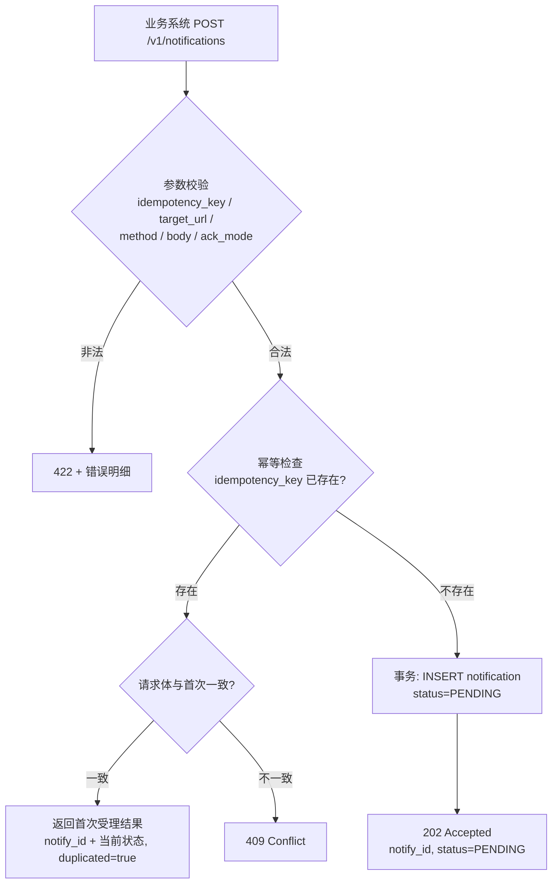
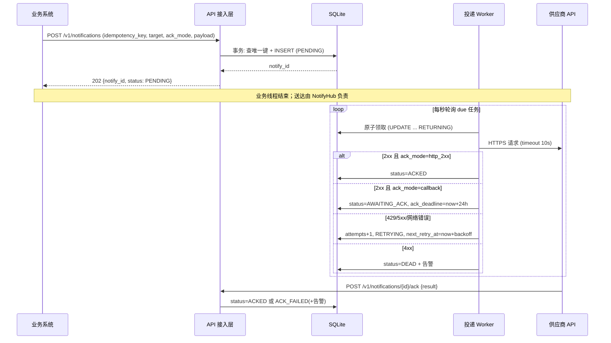

# 技术设计文档：NotifyHub v2.0

> 版本：v2.0 ｜ 上游：`docs/prd.md` v2.0（决策 D1–D4）｜ 下游：`docs/test-cases.md`
> v2.0 变更：落实 D1（业务级回执：新增 ack 接口与确认状态机）、D3（退避序列扩展至 7 档、分级告警）、数据模型与接口相应升级。

## 1. 总体架构

```
┌────────────┐  POST /v1/notifications  ┌───────────────────────────────────────────┐
│  业务系统   │ ───────────────────────▶ │               NotifyHub (单进程)           │
└────────────┘ ◀─────────────────────── │                                           │
                            202 Accepted │  ┌──────────────┐    ┌──────────────┐     │
                            + notify_id  │  │ API 接入层    │───▶│ 任务存储      │     │
                                         │  │ (Hono)       │    │  (SQLite)    │     │
                                         │  └──────┬───────┘    └──────┬───────┘     │
                                         │         │ query             │ poll/claim  │
                                         │  ┌──────┴───────┐    ┌──────┴───────┐     │
                              GET status │  │ 回执接收      │    │ 投递 Worker   │     │
        POST /v1/notifications/{id}/ack ─┼─▶│ /ack         │    └──────┬───────┘     │
                              (供应商)   │  └──────────────┘           ▼             │
                                         └───────────────────────────┼─────────────┘
                                                                       ▼ HTTPS
                                                              ┌──────────────────┐
                                                              │  外部供应商 API     │
                                                              │ (处理后回执 ack)   │
                                                              └──────────────────┘
```

**核心决策：受理 / 投递 / 确认三段解耦。**

- 受理：只做「校验 + 事务持久化 + 回执」，是写路径可靠性的第一道防线（D4）；
- 投递：Worker 异步执行，承载传输层重试（D3）；
- 确认：独立的回执通道，解决「HTTP 2xx ≠ 业务生效」的假送达问题（D1）。

三段之间只通过存储状态机衔接，任意一段崩溃不影响已持久化的数据。

### 1.1 技术选型

| 组件 | 选择 | 理由 | 不用的替代方案 |
| --- | --- | --- | --- |
| 语言/运行时 | TypeScript + Node.js (≥20) | 生态成熟；HTTP 客户端与异步模型齐备；作业不限栈 | Go（迭代慢）、Python（类型表达弱） |
| Web 框架 | Hono | 轻量、类型推导好、单机足够 | NestJS（MVP 过重） |
| 任务存储 | SQLite（WAL） | 事务 + 唯一索引 + 原子领取，零外部依赖；万级 TPS 远超 MVP 需求 | Postgres（独立部署过重）、内存队列（违背可靠性目标） |
| HTTP 客户端 | undici（Node 内置 fetch） | 零依赖，超时控制齐全 | axios |
| 告警（MVP） | 日志 + 指标计数点 | 告警通道（PagerDuty/钉钉等）属部署项，MVP 只保证信号可观测 | 直接对接具体告警平台（绑定部署环境） |

**为什么 MVP 不引入消息队列？** 单机场景下 SQLite 已提供「持久化 + 可见性 + 原子领取」三要素；MQ 带来部署、运维、语义对齐三重成本而收益（水平扩展、削峰）在 MVP 阶段用不上。演进见 §6。

## 2. 核心流程

### 2.1 提交通知（受理）



### 2.2 投递与送达确认（Worker + ack）

```mermaid
flowchart TD
    A[Worker 每 1s 轮询 due 任务<br/>status=PENDING/RETRYING 且 next_retry_at<=now] --> B[原子 claim: status→IN_FLIGHT]
    B --> C[发出 HTTPS 请求 timeout=10s]
    C --> D{结果分类}
    D -- 2xx --> E{ack_mode?}
    E -- callback --> F[status=DELIVERED<br/>进入 AWAITING_ACK<br/>ack_deadline=now+24h]
    E -- http_2xx --> G[status=ACKED 终态 ✅<br/>记录 completed_at]
    D -- 429 --> H[可重试: 按 Retry-After 与退避取大者]
    D -- 5xx / 网络错误 --> H
    D -- 4xx 除429 --> I[status=DEAD ❌ 不重试]
    H --> J{attempts+1 ≥ max_attempts(8)?}
    J -- 否 --> K[status=RETRYING<br/>next_retry_at=now+backoff(attempts)+jitter]
    J -- 是 --> L[status=DEAD ❌ + critical 告警]
    M[供应商调用 POST /v1/notifications/{id}/ack] --> N{result}
    N -- success --> O[status=ACKED ✅ 终态]
    N -- failed --> P[status=ACK_FAILED ⚠️ + critical 告警<br/>保留记录待人工]
```

### 2.3 端到端时序图



## 3. 数据模型

```sql
CREATE TABLE notifications (
  id              TEXT PRIMARY KEY,            -- uuid v7
  idempotency_key TEXT NOT NULL UNIQUE,        -- D2: 幂等键，唯一索引兜底并发
  target_url      TEXT NOT NULL,
  method          TEXT NOT NULL DEFAULT 'POST',
  headers         TEXT NOT NULL DEFAULT '{}',  -- JSON
  body            TEXT,                        -- 透传请求体原文
  ack_mode        TEXT NOT NULL DEFAULT 'http_2xx',  -- D1: callback | http_2xx
  status          TEXT NOT NULL,               -- PENDING/IN_FLIGHT/RETRYING/DELIVERED/
                                               -- AWAITING_ACK/ACKED/ACK_FAILED/DEAD
  attempts        INTEGER NOT NULL DEFAULT 0,
  max_attempts    INTEGER NOT NULL DEFAULT 8,
  next_retry_at   INTEGER,                     -- epoch ms；投递态为 NULL，ACK 态仅 ack_deadline 有意义
  backoff         INTEGER NOT NULL DEFAULT 0,  -- 当前退避档位的下标，用于恢复时续算
  last_error      TEXT,
  ack_deadline    INTEGER,                     -- AWAITING_ACK 超时时刻（epoch ms）
  ack_result      TEXT,                        -- 回执原文摘要（成功为空）
  created_at      INTEGER NOT NULL,
  completed_at    INTEGER
);
CREATE INDEX idx_due ON notifications(status, next_retry_at) WHERE status IN ('PENDING','RETRYING');
CREATE INDEX idx_ack_due ON notifications(status, ack_deadline) WHERE status = 'AWAITING_ACK';
```

**设计要点：**

- `idempotency_key UNIQUE`：应用层先查后插仍有并发竞态，唯一索引是最终防线（TC-F12 验证）；
- `next_retry_at` 内嵌于主表即「延迟队列」，避免独立队列表的双写一致性；
- `IN_FLIGHT` 为 claim 中间态，Worker 崩溃由恢复扫描兜底（§4.4），防任务永久卡死；
- 两个部分索引分别服务投递扫描与 ack 超时扫描，互不争用。

## 4. 可靠性与失败处理

### 4.1 投递语义

**传输层 at-least-once（D2）+ 确认层业务回执（D1）**。

理论依据（PRD §2.1 两将军问题）：超时重试必然产生重复，跨边界恰一次不可达；可靠性上限 = 重试 + 接收方幂等。因此：

- 重复通知的副作用由业务方生成的 `idempotency_key` 抑制（同事件重投不重复生效）；
- 「送达」由供应商业务回执确认，而非 HTTP 2xx。

### 4.2 失败分类与策略

| 失败类型 | 判定 | 策略 |
| --- | --- | --- |
| 网络错误 / 超时 | fetch 抛错 / AbortError | 可重试，D3 退避 |
| 429 | 状态码 | 可重试，`max(Retry-After, 退避值)` |
| 5xx | 状态码 | 可重试，D3 退避 |
| 4xx（除 429） | 状态码 | **不重试 → DEAD**：请求本身确定无效 |
| 重试耗尽 | attempts ≥ 8 | DEAD + critical 告警 |
| ack 超时 | AWAITING_ACK 超过 ack_deadline(24h) | **warning 告警，状态滞留**，人工处理（MVP 不自动重投，避免假送达场景下的重复放大） |
| ack 明确失败 | result=failed | ACK_FAILED + critical 告警，人工处理 |

### 4.3 退避序列（D3）

| attempts（第 n 次重试后） | 1 | 2 | 3 | 4 | 5 | 6 | 7 |
| --- | --- | --- | --- | --- | --- | --- | --- |
| 间隔 | 1m | 5m | 30m | 2h | 6h | 24h | 72h |

- 每次叠加 ±20% 随机抖动，防恢复瞬间的重试风暴（惊群）；
- 7 次重试覆盖约 4 天故障窗口，符合「内部通知时效容忍为天级」的业务判断；
- `attempts ≥ 4`（约 2 小时仍未成功）触发 warning 告警——此时供应商大概率真的故障了，而不是瞬时抖动。

### 4.4 Worker 崩溃恢复

Worker 重启时恢复扫描：`UPDATE notifications SET status=RETRYING, next_retry_at=now WHERE status='IN_FLIGHT' AND updated_at < now - 60s`，孤儿任务重新入队（at-least-once 允许重复执行）。`backoff` 字段记录档位下标，恢复后续算而非重置。

## 5. 接口定义

### 5.1 POST /v1/notifications — 提交通知

**描述**：受理一条外部 API 通知。**事务落库后才返回**（D4）。

**入参**（application/json）：

| 字段 | 类型 | 必填 | 说明 |
| --- | --- | --- | --- |
| idempotency_key | string(≤128) | 是 | 业务方生成的全局唯一幂等键 |
| target_url | string(url) | 是 | 供应商通知地址，MVP 仅允许 https |
| method | string | 否 | `POST`（默认）/ `PUT` / `PATCH` |
| headers | object | 否 | 透传 Header（JSON 对象），禁止覆盖 `Host`/`Content-Length` |
| body | any(json) | 否 | 透传请求体，原样序列化 |
| ack_mode | string | 否 | `http_2xx`（默认）/ `callback`（D1：2xx 后置为 DELIVERED，等待业务回执） |

**出参**：

`202 Accepted`
```json
{ "notify_id": "01J8…", "status": "PENDING", "duplicated": false }
```
`duplicated=true`：命中幂等，返回首次 notify_id 与当前状态。

`422`：`{ "error": "VALIDATION_FAILED", "fields": [{"field":"target_url","reason":"must be https"}] }`

`409`：`{ "error": "IDEMPOTENCY_CONFLICT" }` — 同 key 不同请求体。

### 5.2 GET /v1/notifications/{notify_id} — 查询状态

**出参** `200 OK`：
```json
{
  "notify_id": "01J8…",
  "status": "AWAITING_ACK",
  "attempts": 1,
  "max_attempts": 8,
  "next_retry_at": null,
  "ack_deadline": "2026-09-04T11:00:00Z",
  "last_error": null,
  "created_at": "…", "completed_at": null
}
```
`404`：`{ "error": "NOT_FOUND" }`

### 5.3 POST /v1/notifications/{id}/ack — 送达回执（D1）

**描述**：供应商/对接方在业务处理完成后确认送达。这是「假送达」问题的解，也是 2xx 与「送达」之间的语义桥梁。

**入参**：
| 字段 | 类型 | 必填 | 说明 |
| --- | --- | --- | --- |
| result | string | 是 | `success` / `failed` |
| reason | string | 否 | failed 时的业务原因，记入 ack_result |

**出参**：
- `200`：`{ "notify_id": "…", "status": "ACKED" }`（或 ACK_FAILED）
- `404`：notify_id 不存在
- `409`：`{ "error": "INVALID_STATE" }` — 当前非 AWAITING_ACK 态（如重复回执、http_2xx 模式任务），保证状态机不被非法迁移

**超时扫描**：独立定时器每秒扫描 `AWAITING_ACK AND ack_deadline < now` → warning 告警，状态保持滞留（MVP 人工处理）。

### 5.4 状态机

```
PENDING ──claim──▶ IN_FLIGHT ─┬─ 2xx + ack_mode=http_2xx ─────────────────▶ ACKED ✅
                              ├─ 2xx + ack_mode=callback ─▶ DELIVERED ─▶ AWAITING_ACK
                              │                                              ├─ ack success ─▶ ACKED ✅
                              │                                              ├─ ack failed ────▶ ACK_FAILED ⚠️(+告警)
                              │                                              └─ 超时24h ──────▶ 滞留 + warning 告警
                              ├─ 429/5xx/网络错误 ─▶ RETRYING ──到期──▶ 回到可领取态
                              └─ 4xx(除429) / attempts≥8 ─▶ DEAD ❌(+critical 告警)
```

对外暴露：`PENDING / RETRYING / DELIVERED / AWAITING_ACK / ACKED / ACK_FAILED / DEAD`；`IN_FLIGHT` 内部态（查询映射为 RETRYING/PENDING）。

## 6. 演进路线

| 阶段 | 触发条件 | 演进动作 |
| --- | --- | --- |
| v1.0（本文） | — | 单实例 + SQLite + 进程内 Worker + ack 通道 |
| v1.1 | 死信/ACK_FAILED 需处理 | 重放接口 + 管理台；AWAITING_ACK 超时自动重投（可配置次数） |
| v2.0 | 超过单机 SQLite 写入上限 / 需 HA | 存储换 Postgres（`FOR UPDATE SKIP LOCKED`）；Worker 多实例竞争消费；API 层无状态扩展 |
| v2.1 | 峰值尖刺明显 | 前置 MQ 削峰，存储退化为最终状态；此时 MQ 收益才大于运维成本 |
| v3.0 | 供应商/模板化诉求增长 | 模板引擎 + 供应商级配置中心；按供应商维度的熔断、限流、熔断半开探测 |

## 7. AI 方案中未采纳的"过度设计"（取舍记录）

1. **Kafka + 消费者组**：单机 MVP 用 SQLite 退避列即可满足三要素；MQ 成本远大于收益（v2.1 再议）。
2. **Exactly-once 投递 + 去重表**：跨外部系统边界物理不可达（两将军问题），at-least-once + 幂等键是诚实的语义。
3. **BullMQ + Redis**：Redis 默认持久化不满足「受理即持久」（D4）。
4. **回调业务方（webhook 回执给业务系统）**：业务方不消费返回值；状态查询已覆盖。
5. **ack 超时自动无限重投**：假送达场景（供应商实际处理成功但回执丢失）下自动重投会放大副作用；MVP 选择告警 + 人工，v1.1 再提供受控重放。
